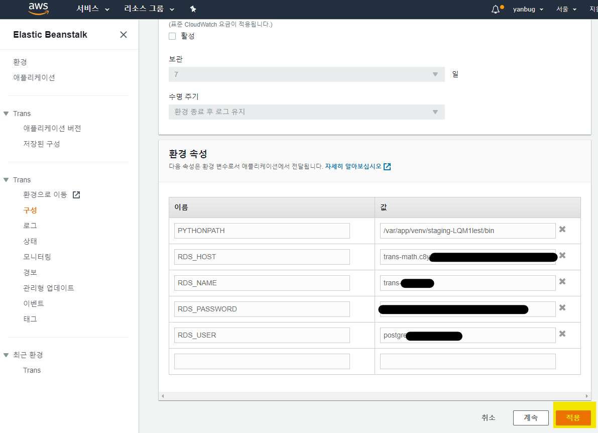

* Development Env.
* post date : 2020. 06. 17
* OS : macOS Catalina 64bit, Windows 10 64bit
* Python : 3.8
* Django : 2.2.5
* Tool : PyCharm 2018.3.5 (Community Edition)
* JRE : 1.8.0_152-release-1343-b28 amd64
* JVM : OpenJDK 64-Bit Server VM by 

본 포스팅은 https://academy.nomadcoders.co/[Nomad Coders] 의 "[풀스택] 에어비엔비 클론 코딩" 을 기초로 하여 개인 프로젝트를 진행한 과정을 담고 있습니다. 더 자세한 설명이 궁금하신 분은 노마드 코더의 강의를 들어보세요! 많은 도움을 받으실겁니다 :-)


# AWS CLI

## requirements.txt 생성

```
> pipenv run pipenv_to_requirements -f

or

> pipenv freeze > requirements.txt
```
aws는 requirements.txt를 보고 필요한 패키지를 설치합니다. 지금까지 프로젝트를 진행하면서 설치한 모든 패키지들이 aws에도 설치되도록 requirements.txt를 만들어 줍니다.

## DB modify
DB는 이제껏 local로 운영하던 것에서 원격으로 둡니다. 저는 강좌를 따라 aws에서 제공하는 DB서비스 중에서 PostgreSQL을 사용했습니다. Elastic Beanstalk 안에 DB를 두지 않고 따로 만드는 이유는 크게 다음과 같습니다.

1. Elastic Beanstalk이 삭제되면 그 안의 DB를 손실하게 됩니다.
2. 구서버에서 신서버로 운영을 변경할 시, DB 연결 정보만으로 이전의 데이터를 이전할 수 있습니다.
3. 서버와 DB를 함께 두는 것보다 따로 관리하는 것이 보안상 더 좋습니다.


DEBUG 중인지 아닌지에 따라 DB를 달리하기 위해서 변수를 추가합니다.

``` python
# .env
DEBUG=Ture
```

DEBUG의 값을 읽어, 디버그가 아닌 상태에서는 PostgreSQL을 사용하도록 합니다.
```python
# settings.py

DEBUG = bool(os.environ.get("DEBUG"))

...

if DEBUG:

    DATABASES = {
        "default": {
            "ENGINE": "django.db.backends.sqlite3",
            "NAME": os.path.join(BASE_DIR, "db.sqlite3"),
        }
    }
else:

    DATABASES = {
        "default": {
            "ENGINE": "django.db.backends.postgresql",
            "NAME": os.path.join(BASE_DIR, "db.sqlite3"),
        }
    }
```

## RDS 생성
aws에서 제공하는 DB서비스를 통해 데이터베이스를 생성합니다.
https://ap-northeast-2.console.aws.amazon.com/rds/home?region=ap-northeast-2#

좌측 사이드바, 데이터 베이스 -> 데이터 베이스 생성
* Postgresql 선택
* free 선택
* username / password 입력
* 나머지는 건들지 말고 생성!

### RDS란?
Amazon Relational Database Service (Amazon RDS) makes it easy to set up, operate, and scale a relational database in the cloud. It provides cost-efficient and resizable capacity while automating time-consuming administration tasks such as hardware provisioning, database setup, patching and backups.

Amazon Relational Database Service (Amazon RDS)는 관계형 데이터베이스의 설정, 운영 및 확장을 쉽게 만들어 줍니다. 하드웨어 프로비저닝, 데이터베이스 설정, 매치 및 백업과 같은 시간소모적 관리 작업을 자동화 해보세요! 효율적인 가격과 데이터베이스 용량을 조정할 수 있습니다. :-)

프로비저닝(Provisioning) : 네트워크가 사용자에게 새로운 서비스를 제공할 수 있도록 네트워크를 준비하고 설치하는 과정. 서버 프로비저닝은 적절한 시스템, 데이터 및 소프트웨어를 사용하여 서버를 준비하고 네트워크 작업을 위해 서버를 준비하는 작업 세트입니다. 
> 출처: https://bfre.tistory.com/entry/IT-용어-풀이-프로비저닝Provisioning [IT한량]

## postgresql setting
```python
# requirements.txt
psycopg2==2.8.4 (추가)
```
📌수동으로 작성합니다! psycopg2설치하지 않고 직접 작성하는 이유는 설치 시, 문제가 발생한다고 합니다. aws에서 requirements.txt읽어 설치하도록 합니다. 수기로 직접 작성한 내용이므로 freeze, pipenv_to_requirement는 하지 않습니다. 


생성된 데이터베이스 정보로 settings.py에 입력해줍니다.
https://ap-northeast-2.console.aws.amazon.com/rds/home?region=ap-northeast-2#database

```python
if DEBUG:

    DATABASES = {
        "default": {
            "ENGINE": "django.db.backends.sqlite3",
            "NAME": os.path.join(BASE_DIR, "db.sqlite3"),
        }
    }
else:

    DATABASES = {
        "default": {
            "ENGINE": "django.db.backends.postgresql",
            "HOST": os.environ.get("RDS_HOST"),
            "NAME": os.environ.get("RDS_NAME"),
            "USER": os.environ.get("RDS_USER"),
            "PASSWORD": os.environ.get("RDS_PASSWORD"),
            "PORT": "5432",
        }
    }
```

https://ap-northeast-2.console.aws.amazon.com/elasticbeanstalk/home?region=ap-northeast-2#/welcome

1. Elastic Beanstalk -> applocations 클릭
2. 어플리케이션 이름 클릭 -> 환경이름 클릭
3. 좌측 사이드바, 구성 클릭 -> 소프트웨어, 편집 클릭
4. 제일 아래 환경변수 추가
    ``` python
    RDS_HOST="your host"
    RDS_NAME="your name"
    RDS_USER="your user"
    RDS_PASSWORD="your pass"
    ```


작성하고 저장하면, DB가 적용 중이라고 표시가 된다. 다 완료가 되면, requirements 등의 변경사항을 커밋하고 eb deploy를 해준다. deploy가 끝나면 eb logs를 통해 서버의 상태를 살펴볼 수 있는데, 패키지도 설치되었고 여러가지 바빴다는 것이 보인다. 오.
아직 애러가 남았다. ^_^

..

^_ㅠ